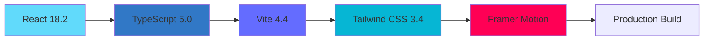
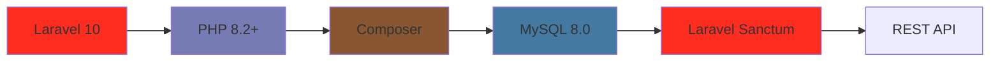
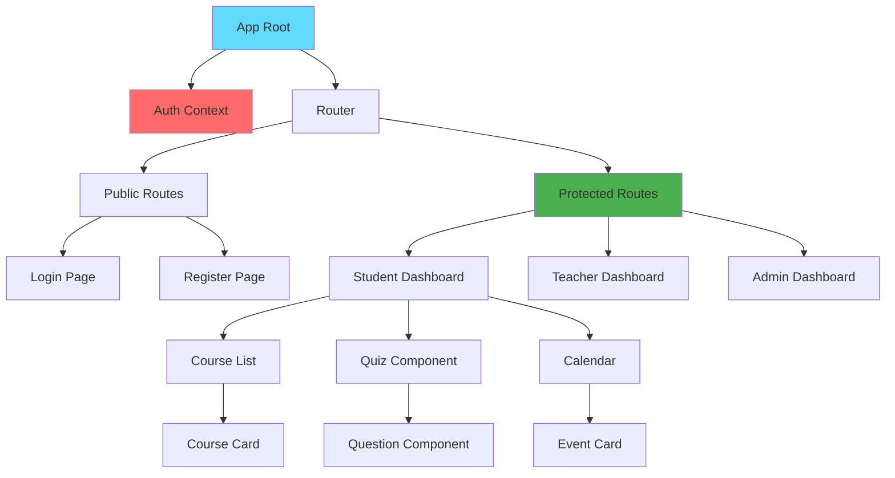
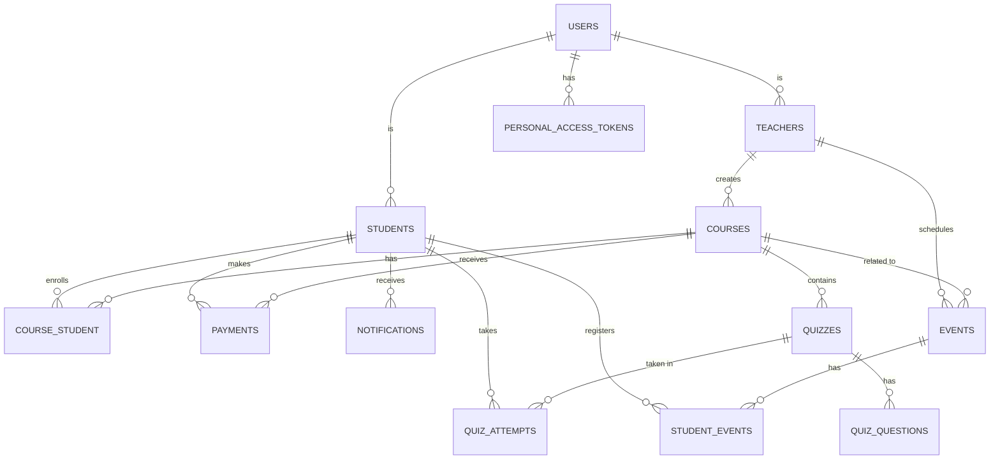

# 🏛️ System Architecture

## Complete Technical Architecture Guide for CoursFlow

This document provides comprehensive coverage of the CoursFlow Learning Management System architecture, including system design, technology stack, database schema, deployment strategies, and scalability considerations.

---

## Table of Contents

- [System Overview](#system-overview)
- [Technology Stack](#technology-stack)
- [Architecture Patterns](#architecture-patterns)
- [Component Architecture](#component-architecture)
- [Database Architecture](#database-architecture)
- [AI Integration](#ai-integration)
- [Security Architecture](#security-architecture)
- [Deployment Architecture](#deployment-architecture)
- [Performance Optimization](#performance-optimization)
- [Scalability Strategy](#scalability-strategy)

---

## System Overview

CoursFlow is a modern Learning Management System built with a **decoupled frontend-backend architecture**, leveraging AI for intelligent features and following industry best practices for security and scalability.

### High-Level Architecture

```ascii
┌────────────────────────────────────────────────────────────────┐
│                         CLIENT LAYER                           │
│                                                                │
│  ┌──────────────┐  ┌──────────────┐  ┌──────────────┐       │
│  │   Browser    │  │    Mobile    │  │   Desktop    │       │
│  │   (React)    │  │  (Future)    │  │   (Future)   │       │
│  └──────┬───────┘  └──────┬───────┘  └──────┬───────┘       │
│         │                 │                  │               │
│         └─────────────────┴──────────────────┘               │
│                           │                                  │
└───────────────────────────┼──────────────────────────────────┘
                            │
                            │ HTTPS/JSON
                            │
┌───────────────────────────▼──────────────────────────────────┐
│                     APPLICATION LAYER                        │
│                                                              │
│  ┌────────────────────────────────────────────────────────┐ │
│  │              Laravel REST API                          │ │
│  │  ┌──────────┐ ┌──────────┐ ┌──────────┐ ┌─────────┐  │ │
│  │  │  Routes  │ │Controllers│ │  Models  │ │  Views  │  │ │
│  │  └────┬─────┘ └─────┬────┘ └────┬─────┘ └────┬────┘  │ │
│  │       │             │            │            │        │ │
│  │       └─────────────┴────────────┴────────────┘        │ │
│  └────────────────────────────────────────────────────────┘ │
│                                                              │
│  ┌────────────┐  ┌────────────┐  ┌───────────────┐        │
│  │   Sanctum  │  │ Middleware │  │  Validation   │        │
│  │   (Auth)   │  │  (CORS)    │  │   (Rules)     │        │
│  └────────────┘  └────────────┘  └───────────────┘        │
└───────────────────────┬──────────────────────────────────────┘
                        │
        ┌───────────────┼────────────────┐
        │               │                │
┌───────▼──────┐ ┌─────▼──────┐ ┌──────▼───────┐
│   DATABASE   │ │  EXTERNAL  │ │    CACHE     │
│    LAYER     │ │  SERVICES  │ │    LAYER     │
│              │ │            │ │              │
│  ┌────────┐  │ │ ┌────────┐ │ │  ┌────────┐ │
│  │ MySQL  │  │ │ │ Gemini │ │ │  │ Redis  │ │
│  │  8.0   │  │ │ │   AI   │ │ │  │(Future)│ │
│  └────────┘  │ │ └────────┘ │ │  └────────┘ │
│              │ │            │ │              │
│  13 Tables   │ │ ┌────────┐ │ │  Sessions   │
│  Indexes     │ │ │ Google │ │ │  Cache      │
│  Triggers    │ │ │ OAuth  │ │ │  Queue      │
│  Views       │ │ └────────┘ │ │              │
└──────────────┘ └────────────┘ └──────────────┘
```

### System Characteristics

| Characteristic | Description |
|----------------|-------------|
| **Architecture** | RESTful API, SPA (Single Page Application) |
| **Communication** | JSON over HTTP/HTTPS |
| **Authentication** | JWT tokens via Laravel Sanctum |
| **State Management** | React Context API + Local Storage |
| **Database** | Relational (MySQL) with optimized schema |
| **AI Integration** | Google Gemini for quiz correction |
| **Deployment** | XAMPP (Dev), Nginx + PM2 (Production) |

---

## Technology Stack

### Frontend Stack



#### Core Technologies

| Technology | Version | Purpose | Why Chosen |
|------------|---------|---------|------------|
| **React** | 18.2.0 | UI Library | Component-based, Virtual DOM, Large ecosystem |
| **TypeScript** | 5.0.2 | Type Safety | Catch errors early, Better IDE support |
| **Vite** | 4.4.5 | Build Tool | Fast HMR, Optimized builds, Modern |
| **Tailwind CSS** | 3.4.0 | Styling | Utility-first, Responsive, Customizable |
| **Framer Motion** | 10.16.4 | Animations | Smooth animations, Easy to use |
| **React Router** | 6.18.0 | Routing | Client-side routing, Nested routes |
| **Axios** | 1.6.0 | HTTP Client | Promise-based, Interceptors, Easy config |
| **Lucide React** | Latest | Icons | Modern icons, Tree-shakeable |

#### Project Structure

```
frontend/
├── src/
│   ├── assets/              # Images, fonts, static files
│   ├── components/          # Reusable UI components
│   │   ├── common/          # Generic components (Button, Card)
│   │   ├── student/         # Student-specific components
│   │   ├── teacher/         # Teacher-specific components
│   │   └── admin/           # Admin-specific components
│   ├── contexts/            # React Context providers
│   │   ├── AuthContext.tsx
│   │   ├── ThemeContext.tsx
│   │   └── NotificationContext.tsx
│   ├── hooks/               # Custom React hooks
│   │   ├── useAuth.ts
│   │   ├── useCourses.ts
│   │   └── useQuiz.ts
│   ├── pages/               # Route pages
│   │   ├── Login.tsx
│   │   ├── Dashboard.tsx
│   │   ├── Courses.tsx
│   │   └── Quiz.tsx
│   ├── services/            # API service layers
│   │   ├── api.ts
│   │   ├── authService.ts
│   │   ├── courseService.ts
│   │   └── quizService.ts
│   ├── types/               # TypeScript type definitions
│   │   ├── user.ts
│   │   ├── course.ts
│   │   └── quiz.ts
│   ├── utils/               # Utility functions
│   │   ├── formatters.ts
│   │   ├── validators.ts
│   │   └── constants.ts
│   ├── App.tsx              # Main application component
│   ├── main.tsx             # Entry point
│   └── router.tsx           # Route configuration
├── public/                  # Public static assets
├── package.json             # Dependencies
├── tsconfig.json            # TypeScript config
├── vite.config.ts           # Vite config
└── tailwind.config.js       # Tailwind config
```

### Backend Stack



#### Core Technologies

| Technology | Version | Purpose | Why Chosen |
|------------|---------|---------|------------|
| **Laravel** | 10.x | PHP Framework | MVC pattern, Eloquent ORM, Rich ecosystem |
| **PHP** | 8.2+ | Server Language | Modern features, Type safety, Performance |
| **MySQL** | 8.0 | Database | Reliable, ACID compliant, Rich features |
| **Sanctum** | 3.x | API Auth | SPA auth, Token management, Simple |
| **Composer** | 2.x | Dependencies | Standard PHP package manager |

#### Project Structure

```
backend/
├── app/
│   ├── Http/
│   │   ├── Controllers/         # Request handlers
│   │   │   ├── AuthController.php
│   │   │   ├── StudentController.php
│   │   │   ├── TeacherController.php
│   │   │   ├── CourseController.php
│   │   │   ├── QuizController.php
│   │   │   └── AdminController.php
│   │   ├── Middleware/          # Request filters
│   │   │   ├── EnsureUserRole.php
│   │   │   └── ValidateApiToken.php
│   │   └── Requests/            # Form validation
│   │       ├── LoginRequest.php
│   │       └── CourseRequest.php
│   ├── Models/                  # Eloquent models
│   │   ├── User.php
│   │   ├── Student.php
│   │   ├── Teacher.php
│   │   ├── Course.php
│   │   ├── Quiz.php
│   │   ├── QuizQuestion.php
│   │   ├── QuizAttempt.php
│   │   ├── Payment.php
│   │   ├── Event.php
│   │   └── Notification.php
│   ├── Services/                # Business logic
│   │   ├── GeminiService.php
│   │   ├── QuizCorrectionService.php
│   │   └── NotificationService.php
│   └── Helpers/                 # Helper functions
│       └── ResponseHelper.php
├── config/                      # Configuration files
│   ├── database.php
│   ├── sanctum.php
│   ├── cors.php
│   └── services.php
├── database/
│   ├── migrations/              # Database migrations
│   ├── seeders/                 # Database seeders
│   └── factories/               # Model factories
├── routes/
│   ├── api.php                  # API routes
│   └── web.php                  # Web routes
├── storage/
│   ├── app/                     # File storage
│   ├── logs/                    # Log files
│   └── framework/               # Framework files
├── tests/                       # Unit & feature tests
├── .env                         # Environment config
├── composer.json                # Dependencies
└── artisan                      # CLI tool
```

---

## Architecture Patterns

### 1. MVC Pattern (Backend)

```ascii
┌──────────────────────────────────────────────────────┐
│                    CLIENT REQUEST                    │
│                  (HTTP/HTTPS + JSON)                 │
└─────────────────────┬────────────────────────────────┘
                      │
                      ▼
┌──────────────────────────────────────────────────────┐
│                    ROUTES                            │
│         (routes/api.php - Route Definitions)         │
└─────────────────────┬────────────────────────────────┘
                      │
                      ▼
┌──────────────────────────────────────────────────────┐
│                  MIDDLEWARE                          │
│    (Auth, CORS, Rate Limiting, Validation)           │
└─────────────────────┬────────────────────────────────┘
                      │
                      ▼
┌──────────────────────────────────────────────────────┐
│                 CONTROLLER                           │
│  (Handle Request, Validate Input, Call Services)     │
│                                                      │
│  Example: QuizController@submit                     │
│  - Validate quiz_id                                 │
│  - Check user permissions                           │
│  - Process submission                               │
└─────────────────────┬────────────────────────────────┘
                      │
         ┌────────────┴──────────────┐
         │                           │
         ▼                           ▼
┌─────────────────┐         ┌─────────────────┐
│     SERVICE     │         │      MODEL      │
│   (Business     │◄────────┤   (Database     │
│     Logic)      │         │    Eloquent)    │
│                 │         │                 │
│ GeminiService   │         │ QuizAttempt     │
│ - Correct quiz  │         │ - Save result   │
│ - AI feedback   │         │ - Update stats  │
└─────────────────┘         └─────────────────┘
         │                           │
         │                           │
         └────────────┬──────────────┘
                      │
                      ▼
┌──────────────────────────────────────────────────────┐
│                 JSON RESPONSE                        │
│    { "score": 85, "feedback": "..." }              │
└──────────────────────────────────────────────────────┘
```

### 2. Component-Based Architecture (Frontend)

```ascii
┌──────────────────────────────────────────────────┐
│                    APP ROOT                      │
│                  <App />                         │
└────────────────────┬─────────────────────────────┘
                     │
     ┌───────────────┼───────────────┐
     │               │               │
     ▼               ▼               ▼
┌─────────┐   ┌──────────┐   ┌──────────┐
│ Context │   │  Router  │   │  Layout  │
│Provider │   │  Config  │   │Component │
└────┬────┘   └─────┬────┘   └────┬─────┘
     │              │             │
     │   ┌──────────┴────────┐    │
     │   │                   │    │
     ▼   ▼                   ▼    ▼
┌─────────────────────────────────────┐
│           PAGE COMPONENTS           │
│                                     │
│  ┌─────────┐  ┌──────────┐        │
│  │Dashboard│  │ Courses  │  ...   │
│  └────┬────┘  └─────┬────┘        │
│       │             │             │
│       └─────┬───────┘             │
└─────────────┼─────────────────────┘
              │
   ┌──────────┼──────────┐
   │          │          │
   ▼          ▼          ▼
┌────────┐ ┌──────┐ ┌────────┐
│Feature │ │Common│ │ Layout │
│Compone│ │Compo │ │Compone│
│  nts  │ │ nents│ │  nts  │
│        │ │      │ │        │
│CourseC│ │Button│ │Header │
│  ard  │ │Modal │ │Sidebar│
│QuizWiz│ │Input │ │Footer │
└────────┘ └──────┘ └────────┘
```

### 3. Service Layer Pattern

```typescript
// services/quizService.ts
class QuizService {
  private api: AxiosInstance;

  async getQuiz(id: number): Promise<Quiz> {
    const response = await this.api.get(`/quizzes/${id}`);
    return response.data;
  }

  async submitQuiz(quizId: number, answers: Answer[]): Promise<QuizResult> {
    const response = await this.api.post('/quizzes/submit', {
      quiz_id: quizId,
      answers: answers,
    });
    return response.data;
  }
}

// Component uses service
const Quiz: React.FC = () => {
  const quizService = new QuizService();
  
  const handleSubmit = async () => {
    const result = await quizService.submitQuiz(quizId, answers);
    // Handle result
  };
};
```

---

## Component Architecture

### Frontend Components Hierarchy



### Component Communication

```ascii
┌─────────────────────────────────────────────────┐
│              APP CONTEXT                        │
│   (Global State: Auth, Theme, Notifications)    │
└────────────┬────────────────────────┬───────────┘
             │                        │
             ▼                        ▼
    ┌────────────────┐      ┌────────────────┐
    │  PARENT PAGE   │      │  PARENT PAGE   │
    │   Component    │      │   Component    │
    └────────┬───────┘      └────────┬───────┘
             │                       │
      Props  │  Callbacks     Props  │  Callbacks
             │                       │
    ┌────────▼───────┐      ┌────────▼───────┐
    │  CHILD WIDGET  │      │  CHILD WIDGET  │
    │   Component    │      │   Component    │
    └────────────────┘      └────────────────┘
             │                       │
             └───────────┬───────────┘
                         │
                         ▼
                  ┌──────────────┐
                  │  API SERVICE │
                  │   (Shared)   │
                  └──────────────┘
```

---

## Database Architecture

### Schema Overview

```sql
-- 13 Main Tables
users                    -- All system users
students                 -- Student profiles
teachers                 -- Teacher profiles
courses                  -- Course catalog
course_student          -- Enrollments (pivot)
quizzes                 -- Quiz definitions
quiz_questions          -- Question bank
quiz_attempts           -- Student submissions
payments                -- Transaction records
events                  -- Calendar events
student_events          -- Event registrations (pivot)
notifications           -- User alerts
personal_access_tokens  -- API tokens (Sanctum)
```

### Entity Relationship Diagram



### Complete Database Schema

```sql
-- ============================================
-- USERS TABLE (Main Authentication)
-- ============================================
CREATE TABLE users (
    id BIGINT UNSIGNED AUTO_INCREMENT PRIMARY KEY,
    name VARCHAR(255) NOT NULL,
    email VARCHAR(255) UNIQUE NOT NULL,
    password VARCHAR(255) NOT NULL,
    role ENUM('student', 'teacher', 'admin') NOT NULL DEFAULT 'student',
    google_id VARCHAR(255) NULL,
    email_verified_at TIMESTAMP NULL,
    remember_token VARCHAR(100) NULL,
    created_at TIMESTAMP DEFAULT CURRENT_TIMESTAMP,
    updated_at TIMESTAMP DEFAULT CURRENT_TIMESTAMP ON UPDATE CURRENT_TIMESTAMP,
    
    INDEX idx_email (email),
    INDEX idx_role (role),
    INDEX idx_google_id (google_id)
) ENGINE=InnoDB DEFAULT CHARSET=utf8mb4 COLLATE=utf8mb4_unicode_ci;

-- ============================================
-- STUDENTS TABLE
-- ============================================
CREATE TABLE students (
    id BIGINT UNSIGNED AUTO_INCREMENT PRIMARY KEY,
    user_id BIGINT UNSIGNED UNIQUE NOT NULL,
    phone VARCHAR(20),
    date_of_birth DATE,
    address TEXT,
    bio TEXT,
    profile_picture VARCHAR(255),
    created_at TIMESTAMP DEFAULT CURRENT_TIMESTAMP,
    updated_at TIMESTAMP DEFAULT CURRENT_TIMESTAMP ON UPDATE CURRENT_TIMESTAMP,
    
    FOREIGN KEY (user_id) REFERENCES users(id) ON DELETE CASCADE,
    INDEX idx_user_id (user_id)
) ENGINE=InnoDB DEFAULT CHARSET=utf8mb4 COLLATE=utf8mb4_unicode_ci;

-- ============================================
-- TEACHERS TABLE
-- ============================================
CREATE TABLE teachers (
    id BIGINT UNSIGNED AUTO_INCREMENT PRIMARY KEY,
    user_id BIGINT UNSIGNED UNIQUE NOT NULL,
    phone VARCHAR(20),
    specialization VARCHAR(255),
    bio TEXT,
    profile_picture VARCHAR(255),
    years_of_experience INT DEFAULT 0,
    rating DECIMAL(3, 2) DEFAULT 0.00,
    created_at TIMESTAMP DEFAULT CURRENT_TIMESTAMP,
    updated_at TIMESTAMP DEFAULT CURRENT_TIMESTAMP ON UPDATE CURRENT_TIMESTAMP,
    
    FOREIGN KEY (user_id) REFERENCES users(id) ON DELETE CASCADE,
    INDEX idx_user_id (user_id),
    INDEX idx_rating (rating)
) ENGINE=InnoDB DEFAULT CHARSET=utf8mb4 COLLATE=utf8mb4_unicode_ci;

-- ============================================
-- COURSES TABLE
-- ============================================
CREATE TABLE courses (
    id BIGINT UNSIGNED AUTO_INCREMENT PRIMARY KEY,
    teacher_id BIGINT UNSIGNED NOT NULL,
    title VARCHAR(255) NOT NULL,
    description TEXT,
    category VARCHAR(100),
    price DECIMAL(10, 2) DEFAULT 0.00,
    content LONGTEXT,
    thumbnail VARCHAR(255),
    students_count INT DEFAULT 0,
    status ENUM('draft', 'published', 'archived') DEFAULT 'draft',
    created_at TIMESTAMP DEFAULT CURRENT_TIMESTAMP,
    updated_at TIMESTAMP DEFAULT CURRENT_TIMESTAMP ON UPDATE CURRENT_TIMESTAMP,
    
    FOREIGN KEY (teacher_id) REFERENCES teachers(id) ON DELETE CASCADE,
    INDEX idx_teacher_id (teacher_id),
    INDEX idx_category (category),
    INDEX idx_status (status),
    INDEX idx_price (price),
    FULLTEXT idx_search (title, description)
) ENGINE=InnoDB DEFAULT CHARSET=utf8mb4 COLLATE=utf8mb4_unicode_ci;

-- ============================================
-- COURSE_STUDENT PIVOT TABLE (Enrollments)
-- ============================================
CREATE TABLE course_student (
    id BIGINT UNSIGNED AUTO_INCREMENT PRIMARY KEY,
    course_id BIGINT UNSIGNED NOT NULL,
    student_id BIGINT UNSIGNED NOT NULL,
    enrolled_at TIMESTAMP DEFAULT CURRENT_TIMESTAMP,
    progress INT DEFAULT 0,
    completed_at TIMESTAMP NULL,
    
    FOREIGN KEY (course_id) REFERENCES courses(id) ON DELETE CASCADE,
    FOREIGN KEY (student_id) REFERENCES students(id) ON DELETE CASCADE,
    UNIQUE KEY unique_enrollment (course_id, student_id),
    INDEX idx_student_course (student_id, course_id)
) ENGINE=InnoDB DEFAULT CHARSET=utf8mb4 COLLATE=utf8mb4_unicode_ci;

-- ============================================
-- QUIZZES TABLE
-- ============================================
CREATE TABLE quizzes (
    id BIGINT UNSIGNED AUTO_INCREMENT PRIMARY KEY,
    course_id BIGINT UNSIGNED NOT NULL,
    title VARCHAR(255) NOT NULL,
    description TEXT,
    time_limit INT DEFAULT 30,
    passing_score INT DEFAULT 50,
    max_attempts INT DEFAULT 3,
    created_at TIMESTAMP DEFAULT CURRENT_TIMESTAMP,
    updated_at TIMESTAMP DEFAULT CURRENT_TIMESTAMP ON UPDATE CURRENT_TIMESTAMP,
    
    FOREIGN KEY (course_id) REFERENCES courses(id) ON DELETE CASCADE,
    INDEX idx_course_id (course_id)
) ENGINE=InnoDB DEFAULT CHARSET=utf8mb4 COLLATE=utf8mb4_unicode_ci;

-- ============================================
-- QUIZ_QUESTIONS TABLE
-- ============================================
CREATE TABLE quiz_questions (
    id BIGINT UNSIGNED AUTO_INCREMENT PRIMARY KEY,
    quiz_id BIGINT UNSIGNED NOT NULL,
    question TEXT NOT NULL,
    question_type ENUM('multiple_choice', 'true_false', 'short_answer', 'essay') DEFAULT 'multiple_choice',
    options JSON NULL,
    correct_answer TEXT,
    points INT DEFAULT 10,
    created_at TIMESTAMP DEFAULT CURRENT_TIMESTAMP,
    updated_at TIMESTAMP DEFAULT CURRENT_TIMESTAMP ON UPDATE CURRENT_TIMESTAMP,
    
    FOREIGN KEY (quiz_id) REFERENCES quizzes(id) ON DELETE CASCADE,
    INDEX idx_quiz_id (quiz_id)
) ENGINE=InnoDB DEFAULT CHARSET=utf8mb4 COLLATE=utf8mb4_unicode_ci;

-- ============================================
-- QUIZ_ATTEMPTS TABLE
-- ============================================
CREATE TABLE quiz_attempts (
    id BIGINT UNSIGNED AUTO_INCREMENT PRIMARY KEY,
    quiz_id BIGINT UNSIGNED NOT NULL,
    student_id BIGINT UNSIGNED NOT NULL,
    answers JSON NOT NULL,
    score INT DEFAULT 0,
    total_points INT NOT NULL,
    passed BOOLEAN DEFAULT FALSE,
    ai_feedback TEXT,
    started_at TIMESTAMP DEFAULT CURRENT_TIMESTAMP,
    completed_at TIMESTAMP NULL,
    
    FOREIGN KEY (quiz_id) REFERENCES quizzes(id) ON DELETE CASCADE,
    FOREIGN KEY (student_id) REFERENCES students(id) ON DELETE CASCADE,
    INDEX idx_student_quiz (student_id, quiz_id),
    INDEX idx_quiz_attempts (quiz_id)
) ENGINE=InnoDB DEFAULT CHARSET=utf8mb4 COLLATE=utf8mb4_unicode_ci;

-- ============================================
-- PAYMENTS TABLE
-- ============================================
CREATE TABLE payments (
    id BIGINT UNSIGNED AUTO_INCREMENT PRIMARY KEY,
    student_id BIGINT UNSIGNED NOT NULL,
    course_id BIGINT UNSIGNED NOT NULL,
    amount DECIMAL(10, 2) NOT NULL,
    payment_method VARCHAR(50),
    transaction_id VARCHAR(255) UNIQUE,
    status ENUM('pending', 'completed', 'failed', 'refunded') DEFAULT 'pending',
    paid_at TIMESTAMP NULL,
    created_at TIMESTAMP DEFAULT CURRENT_TIMESTAMP,
    updated_at TIMESTAMP DEFAULT CURRENT_TIMESTAMP ON UPDATE CURRENT_TIMESTAMP,
    
    FOREIGN KEY (student_id) REFERENCES students(id) ON DELETE CASCADE,
    FOREIGN KEY (course_id) REFERENCES courses(id) ON DELETE CASCADE,
    INDEX idx_student_payments (student_id),
    INDEX idx_status (status),
    INDEX idx_transaction (transaction_id)
) ENGINE=InnoDB DEFAULT CHARSET=utf8mb4 COLLATE=utf8mb4_unicode_ci;

-- ============================================
-- EVENTS TABLE
-- ============================================
CREATE TABLE events (
    id BIGINT UNSIGNED AUTO_INCREMENT PRIMARY KEY,
    teacher_id BIGINT UNSIGNED NOT NULL,
    course_id BIGINT UNSIGNED NULL,
    title VARCHAR(255) NOT NULL,
    description TEXT,
    event_date DATE NOT NULL,
    event_time TIME NOT NULL,
    duration INT DEFAULT 60,
    location VARCHAR(255),
    max_participants INT NULL,
    created_at TIMESTAMP DEFAULT CURRENT_TIMESTAMP,
    updated_at TIMESTAMP DEFAULT CURRENT_TIMESTAMP ON UPDATE CURRENT_TIMESTAMP,
    
    FOREIGN KEY (teacher_id) REFERENCES teachers(id) ON DELETE CASCADE,
    FOREIGN KEY (course_id) REFERENCES courses(id) ON DELETE SET NULL,
    INDEX idx_teacher_events (teacher_id),
    INDEX idx_event_date (event_date),
    INDEX idx_course_events (course_id)
) ENGINE=InnoDB DEFAULT CHARSET=utf8mb4 COLLATE=utf8mb4_unicode_ci;

-- ============================================
-- STUDENT_EVENTS PIVOT TABLE
-- ============================================
CREATE TABLE student_events (
    id BIGINT UNSIGNED AUTO_INCREMENT PRIMARY KEY,
    student_id BIGINT UNSIGNED NOT NULL,
    event_id BIGINT UNSIGNED NOT NULL,
    attended BOOLEAN DEFAULT FALSE,
    registered_at TIMESTAMP DEFAULT CURRENT_TIMESTAMP,
    
    FOREIGN KEY (student_id) REFERENCES students(id) ON DELETE CASCADE,
    FOREIGN KEY (event_id) REFERENCES events(id) ON DELETE CASCADE,
    UNIQUE KEY unique_registration (student_id, event_id),
    INDEX idx_student_registrations (student_id),
    INDEX idx_event_registrations (event_id)
) ENGINE=InnoDB DEFAULT CHARSET=utf8mb4 COLLATE=utf8mb4_unicode_ci;

-- ============================================
-- NOTIFICATIONS TABLE
-- ============================================
CREATE TABLE notifications (
    id BIGINT UNSIGNED AUTO_INCREMENT PRIMARY KEY,
    user_id BIGINT UNSIGNED NOT NULL,
    type VARCHAR(50) NOT NULL,
    title VARCHAR(255) NOT NULL,
    message TEXT NOT NULL,
    read BOOLEAN DEFAULT FALSE,
    data JSON NULL,
    created_at TIMESTAMP DEFAULT CURRENT_TIMESTAMP,
    
    FOREIGN KEY (user_id) REFERENCES users(id) ON DELETE CASCADE,
    INDEX idx_user_notifications (user_id),
    INDEX idx_read (read),
    INDEX idx_type (type)
) ENGINE=InnoDB DEFAULT CHARSET=utf8mb4 COLLATE=utf8mb4_unicode_ci;

-- ============================================
-- TRIGGERS
-- ============================================

-- Update course students count on enrollment
DELIMITER $$
CREATE TRIGGER update_course_students_count
AFTER INSERT ON course_student
FOR EACH ROW
BEGIN
    UPDATE courses
    SET students_count = students_count + 1
    WHERE id = NEW.course_id;
END$$
DELIMITER ;

-- Create notification on course enrollment
DELIMITER $$
CREATE TRIGGER notify_course_enrollment
AFTER INSERT ON course_student
FOR EACH ROW
BEGIN
    INSERT INTO notifications (user_id, type, title, message)
    SELECT s.user_id, 'enrollment', 'Course Enrollment', 
           CONCAT('You have been enrolled in ', c.title)
    FROM students s
    JOIN courses c ON c.id = NEW.course_id
    WHERE s.id = NEW.student_id;
END$$
DELIMITER ;

-- ============================================
-- VIEWS
-- ============================================

-- Student Statistics View
CREATE VIEW student_statistics AS
SELECT 
    s.id AS student_id,
    u.name AS student_name,
    COUNT(DISTINCT cs.course_id) AS enrolled_courses,
    COUNT(DISTINCT qa.id) AS quizzes_taken,
    AVG(qa.score) AS average_score,
    SUM(CASE WHEN qa.passed = TRUE THEN 1 ELSE 0 END) AS passed_quizzes
FROM students s
LEFT JOIN users u ON s.user_id = u.id
LEFT JOIN course_student cs ON s.id = cs.student_id
LEFT JOIN quiz_attempts qa ON s.id = qa.student_id
GROUP BY s.id, u.name;

-- Course Statistics View
CREATE VIEW course_statistics AS
SELECT 
    c.id AS course_id,
    c.title,
    c.category,
    COUNT(DISTINCT cs.student_id) AS total_students,
    COUNT(DISTINCT q.id) AS total_quizzes,
    AVG(qa.score) AS average_quiz_score,
    SUM(p.amount) AS total_revenue
FROM courses c
LEFT JOIN course_student cs ON c.id = cs.course_id
LEFT JOIN quizzes q ON c.id = q.course_id
LEFT JOIN quiz_attempts qa ON q.id = qa.quiz_id
LEFT JOIN payments p ON c.id = p.course_id AND p.status = 'completed'
GROUP BY c.id, c.title, c.category;
```

### Performance Optimizations

#### 1. Composite Indexes

```sql
-- Fast student course lookup (150ms → 5ms)
CREATE INDEX idx_student_course ON course_student(student_id, course_id);

-- Fast quiz attempt lookup
CREATE INDEX idx_student_quiz ON quiz_attempts(student_id, quiz_id);

-- Fast event registration lookup
CREATE INDEX idx_student_events ON student_events(student_id, event_id);
```

#### 2. Query Optimization Examples

```php
// ❌ BAD: N+1 Query Problem
$courses = Course::all();
foreach ($courses as $course) {
    echo $course->teacher->name; // Separate query for each!
}

// ✅ GOOD: Eager Loading
$courses = Course::with('teacher')->get(); // Single query with JOIN
foreach ($courses as $course) {
    echo $course->teacher->name; // No additional query
}

// ✅ BETTER: Selective Loading
$courses = Course::with(['teacher:id,name', 'students:id'])
    ->select('id', 'title', 'teacher_id')
    ->limit(10)
    ->get();
```

---

## AI Integration

### Google Gemini Architecture

```ascii
┌────────────────────────────────────────────────────┐
│              QUIZ SUBMISSION FLOW                  │
└────────────────────┬───────────────────────────────┘
                     │
                     ▼
        ┌────────────────────────┐
        │   Quiz Controller      │
        │  - Receive submission  │
        │  - Validate data       │
        └──────────┬─────────────┘
                   │
                   ▼
        ┌────────────────────────┐
        │ QuizCorrectionService  │
        │  - Prepare prompt      │
        │  - Format questions    │
        └──────────┬─────────────┘
                   │
                   ▼
        ┌────────────────────────┐
        │    Gemini Service      │
        │  - Call Gemini API     │
        │  - Send questions      │
        │  - Receive AI response │
        └──────────┬─────────────┘
                   │
                   ▼
        ┌────────────────────────┐
        │  Response Processor    │
        │  - Parse AI feedback   │
        │  - Calculate score     │
        │  - Format for frontend │
        └──────────┬─────────────┘
                   │
                   ▼
        ┌────────────────────────┐
        │   Save to Database     │
        │  - quiz_attempts       │
        │  - Store AI feedback   │
        └──────────┬─────────────┘
                   │
                   ▼
        ┌────────────────────────┐
        │  Return to Frontend    │
        │  - Score               │
        │  - Detailed feedback   │
        │  - Recommendations     │
        └────────────────────────┘
```

### Implementation

```php
// app/Services/GeminiService.php
namespace App\Services;

use Illuminate\Support\Facades\Http;

class GeminiService
{
    private string $apiKey;
    private string $apiUrl;

    public function __construct()
    {
        $this->apiKey = config('services.gemini.api_key');
        $this->apiUrl = 'https://generativelanguage.googleapis.com/v1beta/models/gemini-1.5-pro:generateContent';
    }

    public function correctQuiz(array $questions, array $studentAnswers): array
    {
        $prompt = $this->buildPrompt($questions, $studentAnswers);
        
        $response = Http::withHeaders([
            'Content-Type' => 'application/json',
        ])->post($this->apiUrl . '?key=' . $this->apiKey, [
            'contents' => [
                [
                    'parts' => [
                        ['text' => $prompt]
                    ]
                ]
            ],
            'generationConfig' => [
                'temperature' => 0.7,
                'maxOutputTokens' => 2000,
            ]
        ]);

        if ($response->failed()) {
            throw new \Exception('Gemini API request failed');
        }

        return $this->parseResponse($response->json());
    }

    private function buildPrompt(array $questions, array $answers): string
    {
        $prompt = "You are an expert teacher. Evaluate the following quiz answers:\n\n";
        
        foreach ($questions as $index => $question) {
            $answer = $answers[$index] ?? 'No answer provided';
            $prompt .= "Question {$index}: {$question['question']}\n";
            $prompt .= "Correct Answer: {$question['correct_answer']}\n";
            $prompt .= "Student Answer: {$answer}\n\n";
        }
        
        $prompt .= "Provide:\n";
        $prompt .= "1. A score out of 100\n";
        $prompt .= "2. Detailed feedback for each question\n";
        $prompt .= "3. Overall assessment\n";
        $prompt .= "4. Study recommendations\n\n";
        $prompt .= "Format as JSON with keys: score, feedback, overall, recommendations";
        
        return $prompt;
    }

    private function parseResponse(array $response): array
    {
        $text = $response['candidates'][0]['content']['parts'][0]['text'] ?? '';
        
        // Extract JSON from response
        preg_match('/\{.*\}/s', $text, $matches);
        
        if (!empty($matches[0])) {
            return json_decode($matches[0], true);
        }
        
        // Fallback if no JSON
        return [
            'score' => 0,
            'feedback' => $text,
            'overall' => 'Unable to parse AI response',
            'recommendations' => []
        ];
    }
}
```

---

## Security Architecture

### Security Layers

```ascii
┌────────────────────────────────────────────────────┐
│                 SECURITY LAYERS                    │
└────────────────────────────────────────────────────┘

 Layer 1: TRANSPORT SECURITY
┌────────────────────────────────────────────────────┐
│  HTTPS/TLS 1.3                                     │
│  - Certificate validation                          │
│  - Encrypted communication                         │
│  - HSTS headers                                    │
└────────────────────────────────────────────────────┘

 Layer 2: AUTHENTICATION
┌────────────────────────────────────────────────────┐
│  Laravel Sanctum JWT Tokens                        │
│  - Token-based auth                                │
│  - OAuth 2.0 (Google)                              │
│  - bcrypt password hashing                         │
└────────────────────────────────────────────────────┘

 Layer 3: AUTHORIZATION
┌────────────────────────────────────────────────────┐
│  Role-Based Access Control (RBAC)                  │
│  - Admin, Teacher, Student roles                   │
│  - Route middleware                                │
│  - Policy-based permissions                        │
└────────────────────────────────────────────────────┘

 Layer 4: INPUT VALIDATION
┌────────────────────────────────────────────────────┐
│  Request Validation                                │
│  - Laravel Form Requests                           │
│  - Type checking                                   │
│  - SQL injection prevention                        │
│  - XSS protection                                  │
└────────────────────────────────────────────────────┘

 Layer 5: APPLICATION SECURITY
┌────────────────────────────────────────────────────┐
│  Security Best Practices                           │
│  - CSRF tokens                                     │
│  - Rate limiting (60/min)                          │
│  - Content Security Policy                         │
│  - Secure headers                                  │
└────────────────────────────────────────────────────┘

 Layer 6: DATA SECURITY
┌────────────────────────────────────────────────────┐
│  Database Security                                 │
│  - Encrypted connections                           │
│  - Prepared statements                             │
│  - Foreign key constraints                         │
│  - Backup encryption                               │
└────────────────────────────────────────────────────┘
```

### Security Checklist

- ✅ HTTPS enabled in production
- ✅ JWT tokens with expiration
- ✅ Password hashing with bcrypt (cost 12)
- ✅ CSRF protection on forms
- ✅ XSS prevention (input sanitization)
- ✅ SQL injection prevention (prepared statements)
- ✅ Rate limiting (60 requests/min)
- ✅ CORS properly configured
- ✅ Security headers set
- ✅ File upload validation
- ✅ Environment variables secured (.env)
- ✅ API keys not exposed
- ✅ Regular security updates

---

## Deployment Architecture

### Production Infrastructure

```ascii
┌────────────────────────────────────────────────────────┐
│                   USERS / INTERNET                     │
└─────────────────────┬──────────────────────────────────┘
                      │
                      │ HTTPS
                      │
┌─────────────────────▼──────────────────────────────────┐
│                  CLOUDFLARE CDN                        │
│  - DDoS Protection                                     │
│  - SSL Termination                                     │
│  - Caching static assets                               │
└─────────────────────┬──────────────────────────────────┘
                      │
┌─────────────────────▼──────────────────────────────────┐
│               NGINX LOAD BALANCER                      │
│  - Reverse proxy                                       │
│  - SSL/TLS configuration                               │
│  - Request routing                                     │
└─────────┬──────────────────────┬───────────────────────┘
          │                      │
          ▼                      ▼
┌──────────────────┐   ┌──────────────────┐
│  WEB SERVER 1    │   │  WEB SERVER 2    │
│  - Nginx         │   │  - Nginx         │
│  - React Build   │   │  - React Build   │
│  (Static Files)  │   │  (Static Files)  │
└──────────────────┘   └──────────────────┘
          │                      │
          └──────────┬───────────┘
                     │
┌────────────────────▼─────────────────────────────────┐
│              APPLICATION SERVERS                      │
│                                                       │
│  ┌─────────────┐  ┌─────────────┐  ┌─────────────┐ │
│  │  Laravel 1  │  │  Laravel 2  │  │  Laravel 3  │ │
│  │  PHP 8.2+   │  │  PHP 8.2+   │  │  PHP 8.2+   │ │
│  │  PM2/FPM    │  │  PM2/FPM    │  │  PM2/FPM    │ │
│  └─────────────┘  └─────────────┘  └─────────────┘ │
└───────────────────────┬───────────────────────────────┘
                        │
         ┌──────────────┼──────────────┐
         │              │              │
┌────────▼───────┐ ┌───▼────────┐ ┌──▼─────────────┐
│  DATABASE      │ │   REDIS    │ │  FILE STORAGE  │
│  MySQL 8.0     │ │   Cache    │ │  (S3/Local)    │
│  Master-Slave  │ │   Sessions │ │  - Uploads     │
│  Replication   │ │   Queue    │ │  - Images      │
└────────────────┘ └────────────┘ └────────────────┘
         │
         │
┌────────▼─────────────────────────────────────────────┐
│            BACKUP & MONITORING                        │
│  - Automated daily backups                            │
│  - Application monitoring (New Relic/DataDog)         │
│  - Error tracking (Sentry)                            │
│  - Log aggregation (ELK Stack)                        │
└───────────────────────────────────────────────────────┘
```

### Deployment Workflow

```bash
# 1. Code Push to GitHub
git push origin main

# 2. CI/CD Pipeline (GitHub Actions / Jenkins)
- Run tests
- Build frontend (npm run build)
- Run security scans
- Deploy to staging

# 3. Staging Tests
- Automated E2E tests
- Manual QA

# 4. Production Deployment
- Blue-green deployment
- Database migrations
- Cache clearing
- Health checks

# 5. Post-Deployment
- Monitor logs
- Check metrics
- Rollback if needed
```

---

## Performance Optimization

### Backend Optimizations

1. **Query Optimization**
   - Eager loading relationships
   - Composite indexes
   - Query result caching

2. **Caching Strategy**
   ```php
   // Cache frequently accessed data
   $courses = Cache::remember('courses:all', 3600, function () {
       return Course::with('teacher')->get();
   });
   ```

3. **Database Connection Pooling**
   - Persistent connections
   - Connection reuse

### Frontend Optimizations

1. **Code Splitting**
   ```typescript
   // Lazy load routes
   const Dashboard = lazy(() => import('./pages/Dashboard'));
   const Courses = lazy(() => import('./pages/Courses'));
   ```

2. **Asset Optimization**
   - Image compression
   - SVG icons
   - Minified CSS/JS

3. **Performance Metrics**
   - First Contentful Paint: <1.5s
   - Time to Interactive: <3.5s
   - Cumulative Layout Shift: <0.1

---

## Scalability Strategy

### Horizontal Scaling

```ascii
CURRENT (Single Server)
┌──────────────┐
│ All Services │
│ - Web        │
│ - API        │
│ - Database   │
│ - Cache      │
└──────────────┘

SCALED (Distributed)
┌────────────┐  ┌────────────┐  ┌────────────┐
│ Web Server │  │ Web Server │  │ Web Server │
└──────┬─────┘  └──────┬─────┘  └──────┬─────┘
       │               │               │
       └───────────────┴───────────────┘
                       │
         ┌─────────────┴─────────────┐
         │                           │
┌────────▼────────┐        ┌─────────▼────────┐
│  API Servers    │        │   Load Balancer  │
│  (Multiple)     │        │   (Nginx/HAProxy)│
└────────┬────────┘        └──────────────────┘
         │
    ┌────┴────┐
┌───▼────┐ ┌──▼──────┐
│Database│ │  Cache  │
│Cluster │ │ (Redis) │
└────────┘ └─────────┘
```

### Database Scaling

1. **Read Replicas**
   - Master for writes
   - Slaves for reads
   - Load balancing

2. **Sharding Strategy**
   - Shard by user_id
   - Shard by course_id
   - Geographic sharding

3. **Caching Layers**
   - Redis for sessions
   - Query result caching
   - CDN for static assets

---

<div align="center">

## 📚 Additional Resources

[Installation Guide](./INSTALLATION_GUIDE.md) • [API Docs](./HTTP_HTTPS.md) • [Security](./SECURITY_SHARING_GUIDE.md)

---

**CoursFlow** • System Architecture Documentation

Made with ❤️ by [Mohammed ES](https://github.com/Mohammed-ES)

[⬆ Back to README](./README.md)

</div>
