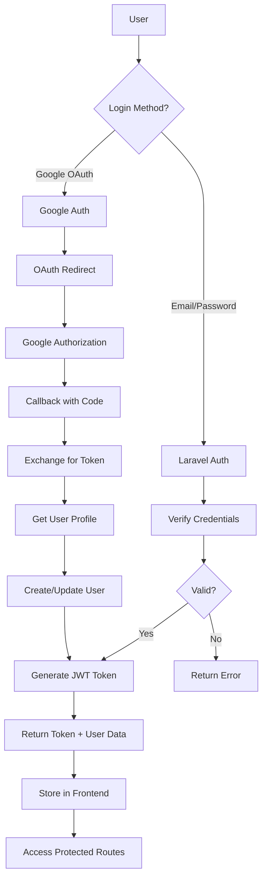

# 🔐 Authentication System

## Complete Guide to CoursFlow's Dual Authentication

CoursFlow implements a **secure dual authentication system** combining traditional email/password login with modern Google OAuth 2.0 social authentication.

---

## Table of Contents

- [Overview](#overview)
- [Architecture](#architecture)
- [Email/Password Authentication](#emailpassword-authentication)
- [Google OAuth 2.0](#google-oauth-20)
- [Security Features](#security-features)
- [API Authentication](#api-authentication)
- [Implementation Examples](#implementation-examples)
- [Troubleshooting](#troubleshooting)

---

## Overview

### Authentication Methods

| Method | Security Level | User Experience | Setup Complexity |
|--------|---------------|-----------------|------------------|
| **Email/Password** | 🔒🔒🔒 High | Traditional | Easy |
| **Google OAuth** | 🔒🔒🔒🔒 Very High | One-click | Medium |

### Key Features

- ✅ **Dual Authentication** - Email or Google login
- ✅ **JWT Tokens** - Secure API access
- ✅ **Role-Based Access** - Admin, Teacher, Student
- ✅ **Session Management** - Persistent login
- ✅ **Password Security** - bcrypt hashing
- ✅ **CSRF Protection** - Laravel middleware
- ✅ **Rate Limiting** - Prevent brute force

---

## Architecture

### Authentication Flow Diagram



### System Components

```ascii
┌─────────────────────────────────────────────────────────────┐
│                      FRONTEND (React)                       │
│                                                             │
│  ┌─────────────┐  ┌─────────────┐  ┌──────────────┐      │
│  │ Login Form  │  │ Google Btn  │  │ Auth Context │      │
│  └──────┬──────┘  └──────┬──────┘  └──────┬───────┘      │
│         │                │                 │              │
└─────────┼────────────────┼─────────────────┼──────────────┘
          │                │                 │
          ▼                ▼                 ▼
┌─────────────────────────────────────────────────────────────┐
│                    BACKEND (Laravel)                        │
│                                                             │
│  ┌──────────────┐  ┌──────────────┐  ┌─────────────┐     │
│  │ AuthController│  │ OAuthController│ │  Sanctum   │     │
│  └──────┬───────┘  └──────┬────────┘  └──────┬──────┘     │
│         │                 │                   │            │
│         ├─────────────────┴───────────────────┤            │
│         │                                     │            │
│  ┌──────▼─────────────────────────────────────▼──────┐    │
│  │              User Model & Database               │    │
│  └──────────────────────────────────────────────────┘    │
└─────────────────────────────────────────────────────────────┘
```

---

## Email/Password Authentication

### Backend Implementation (Laravel)

#### 1. User Model

```php
// app/Models/User.php
namespace App\Models;

use Illuminate\Foundation\Auth\User as Authenticatable;
use Laravel\Sanctum\HasApiTokens;

class User extends Authenticatable
{
    use HasApiTokens;

    protected $fillable = [
        'name', 'email', 'password', 'role', 'google_id'
    ];

    protected $hidden = [
        'password', 'remember_token'
    ];

    protected $casts = [
        'email_verified_at' => 'datetime',
    ];
}
```

#### 2. Authentication Controller

```php
// app/Http/Controllers/AuthController.php
namespace App\Http\Controllers;

use App\Models\User;
use Illuminate\Http\Request;
use Illuminate\Support\Facades\Hash;
use Illuminate\Validation\ValidationException;

class AuthController extends Controller
{
    /**
     * Login with email and password
     */
    public function login(Request $request)
    {
        $request->validate([
            'email' => 'required|email',
            'password' => 'required',
        ]);

        $user = User::where('email', $request->email)->first();

        if (!$user || !Hash::check($request->password, $user->password)) {
            throw ValidationException::withMessages([
                'email' => ['The provided credentials are incorrect.'],
            ]);
        }

        // Generate API token
        $token = $user->createToken('auth-token')->plainTextToken;

        return response()->json([
            'token' => $token,
            'user' => $user,
        ]);
    }

    /**
     * Register new user
     */
    public function register(Request $request)
    {
        $request->validate([
            'name' => 'required|string|max:255',
            'email' => 'required|string|email|max:255|unique:users',
            'password' => 'required|string|min:8|confirmed',
            'role' => 'required|in:student,teacher,admin',
        ]);

        $user = User::create([
            'name' => $request->name,
            'email' => $request->email,
            'password' => Hash::make($request->password),
            'role' => $request->role,
        ]);

        $token = $user->createToken('auth-token')->plainTextToken;

        return response()->json([
            'token' => $token,
            'user' => $user,
        ], 201);
    }

    /**
     * Logout user
     */
    public function logout(Request $request)
    {
        $request->user()->currentAccessToken()->delete();

        return response()->json(['message' => 'Logged out successfully']);
    }

    /**
     * Get authenticated user
     */
    public function user(Request $request)
    {
        return response()->json($request->user());
    }
}
```

#### 3. Routes

```php
// routes/api.php
use App\Http\Controllers\AuthController;

Route::post('/login', [AuthController::class, 'login']);
Route::post('/register', [AuthController::class, 'register']);

Route::middleware('auth:sanctum')->group(function () {
    Route::post('/logout', [AuthController::class, 'logout']);
    Route::get('/user', [AuthController::class, 'user']);
});
```

### Frontend Implementation (React + TypeScript)

#### 1. Auth Context

```typescript
// src/contexts/AuthContext.tsx
import React, { createContext, useContext, useState, useEffect } from 'react';
import axios from 'axios';

interface User {
  id: number;
  name: string;
  email: string;
  role: 'student' | 'teacher' | 'admin';
}

interface AuthContextType {
  user: User | null;
  token: string | null;
  login: (email: string, password: string) => Promise<void>;
  register: (data: RegisterData) => Promise<void>;
  logout: () => void;
  loading: boolean;
}

const AuthContext = createContext<AuthContextType | undefined>(undefined);

export const AuthProvider: React.FC<{ children: React.ReactNode }> = ({ children }) => {
  const [user, setUser] = useState<User | null>(null);
  const [token, setToken] = useState<string | null>(localStorage.getItem('token'));
  const [loading, setLoading] = useState(true);

  useEffect(() => {
    if (token) {
      axios.defaults.headers.common['Authorization'] = `Bearer ${token}`;
      fetchUser();
    } else {
      setLoading(false);
    }
  }, [token]);

  const fetchUser = async () => {
    try {
      const response = await axios.get('/api/user');
      setUser(response.data);
    } catch (error) {
      logout();
    } finally {
      setLoading(false);
    }
  };

  const login = async (email: string, password: string) => {
    const response = await axios.post('/api/login', { email, password });
    const { token, user } = response.data;
    
    localStorage.setItem('token', token);
    axios.defaults.headers.common['Authorization'] = `Bearer ${token}`;
    
    setToken(token);
    setUser(user);
  };

  const register = async (data: RegisterData) => {
    const response = await axios.post('/api/register', data);
    const { token, user } = response.data;
    
    localStorage.setItem('token', token);
    axios.defaults.headers.common['Authorization'] = `Bearer ${token}`;
    
    setToken(token);
    setUser(user);
  };

  const logout = () => {
    localStorage.removeItem('token');
    delete axios.defaults.headers.common['Authorization'];
    setToken(null);
    setUser(null);
  };

  return (
    <AuthContext.Provider value={{ user, token, login, register, logout, loading }}>
      {children}
    </AuthContext.Provider>
  );
};

export const useAuth = () => {
  const context = useContext(AuthContext);
  if (!context) throw new Error('useAuth must be used within AuthProvider');
  return context;
};
```

#### 2. Login Component

```typescript
// src/components/Login.tsx
import React, { useState } from 'react';
import { useAuth } from '../contexts/AuthContext';
import { useNavigate } from 'react-router-dom';

export const Login: React.FC = () => {
  const [email, setEmail] = useState('');
  const [password, setPassword] = useState('');
  const [error, setError] = useState('');
  const { login } = useAuth();
  const navigate = useNavigate();

  const handleSubmit = async (e: React.FormEvent) => {
    e.preventDefault();
    setError('');

    try {
      await login(email, password);
      navigate('/dashboard');
    } catch (err: any) {
      setError(err.response?.data?.message || 'Login failed');
    }
  };

  return (
    <div className="min-h-screen flex items-center justify-center">
      <form onSubmit={handleSubmit} className="bg-white p-8 rounded-lg shadow-md w-96">
        <h2 className="text-2xl font-bold mb-6">Login to CoursFlow</h2>
        
        {error && (
          <div className="bg-red-100 text-red-700 p-3 rounded mb-4">
            {error}
          </div>
        )}

        <div className="mb-4">
          <label className="block text-gray-700 mb-2">Email</label>
          <input
            type="email"
            value={email}
            onChange={(e) => setEmail(e.target.value)}
            className="w-full px-4 py-2 border rounded focus:outline-none focus:ring-2"
            required
          />
        </div>

        <div className="mb-6">
          <label className="block text-gray-700 mb-2">Password</label>
          <input
            type="password"
            value={password}
            onChange={(e) => setPassword(e.target.value)}
            className="w-full px-4 py-2 border rounded focus:outline-none focus:ring-2"
            required
          />
        </div>

        <button
          type="submit"
          className="w-full bg-blue-600 text-white py-2 rounded hover:bg-blue-700"
        >
          Login
        </button>

        <div className="mt-4 text-center">
          <a href="/forgot-password" className="text-blue-600 hover:underline">
            Forgot Password?
          </a>
        </div>
      </form>
    </div>
  );
};
```

---

## Google OAuth 2.0

### Setup Instructions

#### 1. Google Cloud Console Setup

```bash
# 1. Go to Google Cloud Console
https://console.cloud.google.com/

# 2. Create a new project or select existing

# 3. Enable Google+ API
- Navigate to "APIs & Services" > "Library"
- Search for "Google+ API"
- Click "Enable"

# 4. Create OAuth 2.0 Credentials
- Go to "APIs & Services" > "Credentials"
- Click "Create Credentials" > "OAuth client ID"
- Application type: "Web application"
- Name: "CoursFlow"
- Authorized JavaScript origins:
  * http://localhost:5173
  * https://yourproduction.com
- Authorized redirect URIs:
  * http://localhost:8000/api/auth/google/callback
  * https://yourapi.com/api/auth/google/callback

# 5. Save Client ID and Client Secret
```

#### 2. Backend Configuration

```env
# backend/.env
GOOGLE_CLIENT_ID=your-client-id.apps.googleusercontent.com
GOOGLE_CLIENT_SECRET=your-client-secret
GOOGLE_REDIRECT_URI=http://localhost:8000/api/auth/google/callback
```

#### 3. Install Laravel Socialite

```bash
cd backend
composer require laravel/socialite
```

#### 4. Google OAuth Controller

```php
// app/Http/Controllers/GoogleAuthController.php
namespace App\Http\Controllers;

use App\Models\User;
use Illuminate\Http\Request;
use Laravel\Socialite\Facades\Socialite;
use Illuminate\Support\Facades\Hash;
use Illuminate\Support\Str;

class GoogleAuthController extends Controller
{
    /**
     * Redirect to Google OAuth
     */
    public function redirect()
    {
        return Socialite::driver('google')
            ->stateless()
            ->redirect();
    }

    /**
     * Handle Google OAuth callback
     */
    public function callback()
    {
        try {
            $googleUser = Socialite::driver('google')
                ->stateless()
                ->user();

            // Find or create user
            $user = User::where('google_id', $googleUser->id)
                ->orWhere('email', $googleUser->email)
                ->first();

            if (!$user) {
                // Create new user
                $user = User::create([
                    'name' => $googleUser->name,
                    'email' => $googleUser->email,
                    'google_id' => $googleUser->id,
                    'password' => Hash::make(Str::random(24)),
                    'role' => 'student', // Default role
                    'email_verified_at' => now(),
                ]);
            } else {
                // Update Google ID if not set
                if (!$user->google_id) {
                    $user->update(['google_id' => $googleUser->id]);
                }
            }

            // Generate token
            $token = $user->createToken('google-auth-token')->plainTextToken;

            // Redirect to frontend with token
            return redirect()->away(
                env('FRONTEND_URL') . '/auth/callback?token=' . $token
            );

        } catch (\Exception $e) {
            return redirect()->away(
                env('FRONTEND_URL') . '/auth/error?message=' . urlencode($e->getMessage())
            );
        }
    }
}
```

#### 5. OAuth Routes

```php
// routes/api.php
use App\Http\Controllers\GoogleAuthController;

Route::get('/auth/google', [GoogleAuthController::class, 'redirect']);
Route::get('/auth/google/callback', [GoogleAuthController::class, 'callback']);
```

#### 6. Configure Socialite

```php
// config/services.php
return [
    'google' => [
        'client_id' => env('GOOGLE_CLIENT_ID'),
        'client_secret' => env('GOOGLE_CLIENT_SECRET'),
        'redirect' => env('GOOGLE_REDIRECT_URI'),
    ],
];
```

### Frontend Implementation

#### 1. Environment Variables

```env
# frontend/.env
VITE_API_URL=http://localhost:8000
VITE_GOOGLE_CLIENT_ID=your-client-id.apps.googleusercontent.com
```

#### 2. Google Login Button

```typescript
// src/components/GoogleLoginButton.tsx
import React from 'react';
import { useGoogleLogin } from '@react-oauth/google';
import axios from 'axios';
import { useAuth } from '../contexts/AuthContext';

export const GoogleLoginButton: React.FC = () => {
  const { setToken, setUser } = useAuth();

  const login = useGoogleLogin({
    onSuccess: async (tokenResponse) => {
      try {
        // Send token to backend
        const response = await axios.post('/api/auth/google/verify', {
          access_token: tokenResponse.access_token,
        });

        const { token, user } = response.data;
        
        localStorage.setItem('token', token);
        setToken(token);
        setUser(user);
        
      } catch (error) {
        console.error('Google login failed:', error);
      }
    },
    onError: (error) => console.error('Login Failed:', error),
  });

  return (
    <button
      onClick={() => login()}
      className="w-full flex items-center justify-center gap-2 bg-white border-2 border-gray-300 rounded-lg px-4 py-2 hover:bg-gray-50"
    >
      
      <span className="font-medium">Continue with Google</span>
    </button>
  );
};
```

#### 3. Setup Google OAuth Provider

```typescript
// src/main.tsx
import React from 'react';
import ReactDOM from 'react-dom/client';
import { GoogleOAuthProvider } from '@react-oauth/google';
import App from './App';

ReactDOM.createRoot(document.getElementById('root')!).render(
  <React.StrictMode>
    <GoogleOAuthProvider clientId={import.meta.env.VITE_GOOGLE_CLIENT_ID}>
      <App />
    </GoogleOAuthProvider>
  </React.StrictMode>
);
```

---

## Security Features

### 1. Password Security

```php
// Always use bcrypt for password hashing
use Illuminate\Support\Facades\Hash;

// Hash password
$hashedPassword = Hash::make($password);

// Verify password
if (Hash::check($plainPassword, $hashedPassword)) {
    // Password is correct
}
```

### 2. JWT Token Security

```php
// app/Http/Middleware/VerifyApiToken.php
namespace App\Http\Middleware;

use Closure;
use Illuminate\Http\Request;

class VerifyApiToken
{
    public function handle(Request $request, Closure $next)
    {
        if (!$request->bearerToken()) {
            return response()->json(['error' => 'Unauthorized'], 401);
        }

        return $next($request);
    }
}
```

### 3. CSRF Protection

```php
// config/sanctum.php
'stateful' => explode(',', env('SANCTUM_STATEFUL_DOMAINS', sprintf(
    '%s%s',
    'localhost,localhost:3000,127.0.0.1,127.0.0.1:8000,::1',
    env('APP_URL') ? ','.parse_url(env('APP_URL'), PHP_URL_HOST) : ''
))),
```

### 4. Rate Limiting

```php
// app/Http/Kernel.php
protected $middlewareGroups = [
    'api' => [
        'throttle:60,1', // 60 requests per minute
        \Illuminate\Routing\Middleware\SubstituteBindings::class,
    ],
];
```

### 5. Input Validation

```php
// Always validate input
$request->validate([
    'email' => 'required|email|max:255',
    'password' => 'required|string|min:8|regex:/^.*(?=.{3,})(?=.*[a-zA-Z])(?=.*[0-9])(?=.*[\d\x])(?=.*[!$#%]).*$/',
]);
```

---

## API Authentication

### Making Authenticated Requests

#### Frontend (Axios)

```typescript
// src/utils/axios.ts
import axios from 'axios';

const api = axios.create({
  baseURL: import.meta.env.VITE_API_URL,
});

// Add token to all requests
api.interceptors.request.use((config) => {
  const token = localStorage.getItem('token');
  if (token) {
    config.headers.Authorization = `Bearer ${token}`;
  }
  return config;
});

// Handle 401 errors
api.interceptors.response.use(
  (response) => response,
  (error) => {
    if (error.response?.status === 401) {
      localStorage.removeItem('token');
      window.location.href = '/login';
    }
    return Promise.reject(error);
  }
);

export default api;
```

#### Example API Call

```typescript
import api from './utils/axios';

// Get user's courses
const courses = await api.get('/api/student/courses');

// Submit quiz
const result = await api.post('/api/quizzes/submit', {
  quiz_id: 1,
  answers: [...],
});
```

---

## Troubleshooting

### Common Issues

#### 1. "Unauthenticated" Error

```bash
# Check token is being sent
console.log(localStorage.getItem('token'));

# Verify header format
Authorization: Bearer your-token-here
```

#### 2. CORS Errors

```php
// config/cors.php
'paths' => ['api/*', 'sanctum/csrf-cookie'],
'allowed_origins' => [env('FRONTEND_URL', 'http://localhost:5173')],
'supports_credentials' => true,
```

#### 3. Google OAuth Redirect Not Working

```bash
# Check redirect URI matches exactly in:
1. Google Cloud Console
2. Backend .env GOOGLE_REDIRECT_URI
3. Frontend redirect URL
```

#### 4. Token Expiration

```php
// config/sanctum.php
'expiration' => 525600, // 1 year in minutes
```

---

## Best Practices

### ✅ DO

- Always use HTTPS in production
- Implement rate limiting
- Validate all inputs
- Use strong password policies
- Rotate secrets regularly
- Log authentication attempts
- Implement 2FA for admins

### ❌ DON'T

- Store passwords in plain text
- Use weak hashing algorithms
- Expose sensitive data in errors
- Allow unlimited login attempts
- Store tokens in localStorage (use httpOnly cookies in production)
- Hardcode credentials

---

## Testing

### Test Login Endpoint

```bash
# Using curl
curl -X POST http://localhost:8000/api/login \
  -H "Content-Type: application/json" \
  -d '{"email": "student@gmail.com", "password": "password"}'

# Expected response
{
  "token": "1|abcdef123456...",
  "user": {
    "id": 1,
    "name": "John Doe",
    "email": "student@gmail.com",
    "role": "student"
  }
}
```

---

<div align="center">

## Need Help?

📧 Email: support@coursflow.com  
🐛 GitHub Issues: [Report an Issue](https://github.com/Mohammed-ES/CoursFlow/issues)  
💬 Discussions: [Ask Questions](https://github.com/Mohammed-ES/CoursFlow/discussions)

---

[⬆ Back to README](./README.md) • [📖 View All Documentation](./README.md#-documentation)

**CoursFlow** • Secure Authentication System

</div>
